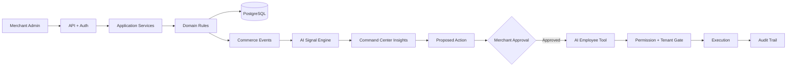

# Commerce OS

## The idea

Commerce OS is being built as a modern merchant operating system: not only a store admin, but a control plane that understands the business, proposes actions, and safely lets specialized AI employees execute approved work.

### The core loop

> **Observe → Understand → Recommend → Approve → Execute → Measure**

## Current build

The `commerce-os-foundation` branch contains the foundation through the AI Employee execution boundary.

### Already built

- Merchant Admin shell
- Products and Orders UI foundations
- Product variants and SKU validation
- Inventory and reservation domain rules
- PostgreSQL repository adapters
- Tenant isolation + RBAC
- Customer and fulfillment foundations
- Explainable AI commerce insights
- Approval-first automation
- AI Employee definitions and permission-scoped tool execution

### Current architecture



## Why follow this project?

The interesting part is what happens after ordinary commerce CRUD is finished.

A merchant should not have to discover every problem manually.

Imagine:

- Inventory Agent notices a stockout risk.
- Command Center explains why it matters.
- AI proposes a replenishment action.
- Merchant approves it.
- Tool executes it with tenant/permission checks.
- Audit trail records what happened.
- Analytics measures whether the decision improved the business.

That is the direction: **an operating system for commerce, not another dashboard.**

## Visual direction

```text
┌──────────────── Commerce OS ────────────────┐
│ AI Command Center              Ask Commerce OS│
├──────────────┬──────────────────────────────┤
│ Overview     │ Business Health      82/100  │
│ Orders       │                              │
│ Products     │ Revenue   Orders   Profit    │
│ Inventory    │ ₹4.82L    1,284    ₹1.31L    │
│ Customers    │                              │
│ Marketing    │ ┌─ Needs Attention ───────┐ │
│ Analytics    │ │ Stockout risk           │ │
│ Automations  │ │ Conversion opportunity  │ │
│ AI Employees │ │ Cart recovery           │ │
│ Settings     │ └──────────────────────────┘ │
└──────────────┴──────────────────────────────┘
```

## Status

This is an active foundation build, **not yet production-ready**. Remaining work is explicitly documented in [`docs/BUILD_PROGRESS.md`](docs/BUILD_PROGRESS.md).
